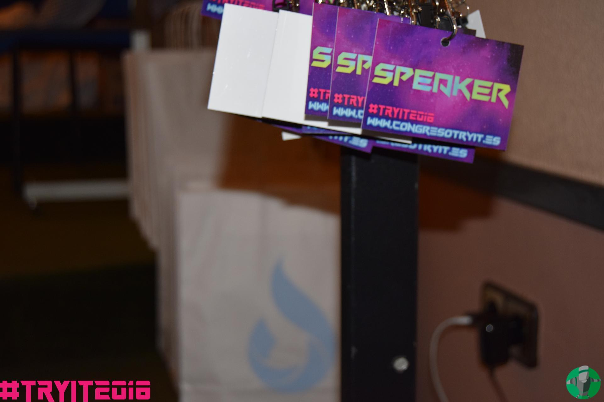

<h1 align="center">
TryIT-photo-signer
</h1>

<p align="center">
    <a href="https://github.com/DA-ETSIINF/TryIT-photo-signer/blob/master/LICENSE">
        
    </a>
</p>
<p align="center">
    <a href="https://github.com/DA-ETSIINF/TryIT-photo-signer/issues">
        
    </a>
    <a href="https://github.com/DA-ETSIINF/TryIT-photo-signer/stargazers">
        
    </a>
    <a href="https://github.com/DA-ETSIINF/TryIT-photo-signer/network">
        
    </a>
</p>

<h4 align="center">
Projecto creado (muy rápido) para firmar las fotos (con el logo y el hastag del evento) hechas durante el evento llamado <a href="www.congresotryit.com">TryIT</a> en la <a href="www.etsiinf.upm.es">Escuela Técnica de Ingenieros Informáticos</a>.
</h4>

## TL;DR

| año | antes | despues |
|:-:|:-:|:-:|
| 2018 | `/photos_input` []() 6000x4000 pixels | `/photos_signed` []() 1920x1280 pixels |

[](https://asciinema.org/a/gKLfs5ZY4tStCzHlVTW8yqIAM)

## Configuración

Crear las siguientes carpertas dentro de esta misma carpeta:

### Fotos

* `/photos_input`: Aquí se dejaran las fotos que queremos firmar. Sólo son válidas las siguientes extensiones: `.png`, `.jpg`.

```bash
$ mkdir photos_input
```

* `/photos_signed`: Aquí se dejaran las fotos firmadas

```bash
$ mkdir photos_signed
```

### Diseño de la firma

* `/fonts`: Aquí se dejaran las tipologias de letras que se quieran usar para firmar las fotos.
* `/logos`: Aquí se dejaran los logos que se quieran usar para firmar las fotos.

#### TryIT2018

Hay una función, llamada `tryit_2018(...)`, en el fichero `tryit_photo_signer.py` que tiene la configuración para la firma del año 2018.

## Ejecución

### Host

0. Tener lo siguiente instalado previamente:

    * `python3.5`
    * `pip3`

1. Installar los paquetes de python necesarios.

```bash
$ pip3 install -r requirements.txt
```

2. Asegurarse de tener las carpetas `/photos_input` y `/photos_signed` creadas.

3. Tener las fotos que se quieren firmar en `/photos_input`.

4. Ejecutar con `python3.5`

```bash
$ python3.5 tryit_photo_signer.py
```

### Docker

0. Tener lo siguiente instalado previamente:

    * `make`
    * Docker
        * Probado con: `Docker version 18.02.0-ce, build fc4de44`
    * Docker compose
        * Probado con: `docker-compose version 1.18.0, build 8dd22a9`

2. Asegurarse de tener las carpetas `/photos_input` y `/photos_signed` creadas.

3. Tener las fotos que se quieren firmar en `/photos_input`.

4. Ejecutar con `make`. Ver el ejemplo de [TL;DR](#TL;DR) para mas detalle.

```bash
$ make
```

### TODO

- [ ] Fichero de configuración YAML
    - [ ] Carpeta donde cargar las fotos originales
    - [ ] Carpeta dede dejar las fotos firmadas
    - [ ] Evento
        - [ ] Nombre
        - [ ] Año
        - [ ] Hashtag
    - [ ] Configuración de las imagenes firmadas
        - [ ] Nombres
        - [ ] Tamaño (`maxwidth`)
        - [ ] Configuración de la firma
            - [ ] `ratio_elements`
            - [ ] Texto
                - [ ] Tipografía
                - [ ] Color
                - [ ] Fondo
                - [ ] Posición
            - [ ] Imagen (logo)
                - [ ] Tipografía
                - [ ] Posición

## Agradecimientos

* [Mike](https://www.blog.pythonlibrary.org/author/mld/) por la entrada *[How to Watermark Your Photos with Python](https://www.blog.pythonlibrary.org/2017/10/17/how-to-watermark-your-photos-with-python/)*
    * Creado: 17 de Octubre de 2017
    * Visto: 1 de Mayo de 2018

## Licencia

[](https://github.com/DA-ETSIINF/TryIT-photo-signer/blob/master/LICENSE)

Ver el fichero [LICENSE](https://github.com/DA-ETSIINF/TryIT-photo-signer/blob/master/LICENSE)